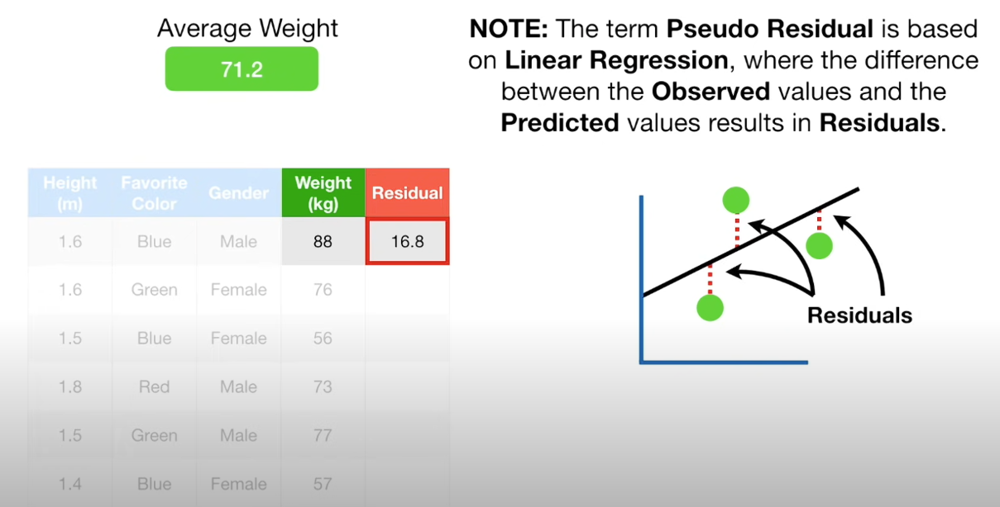
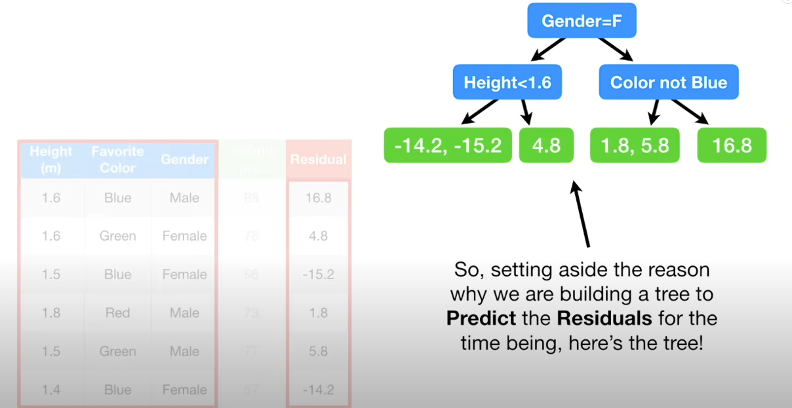
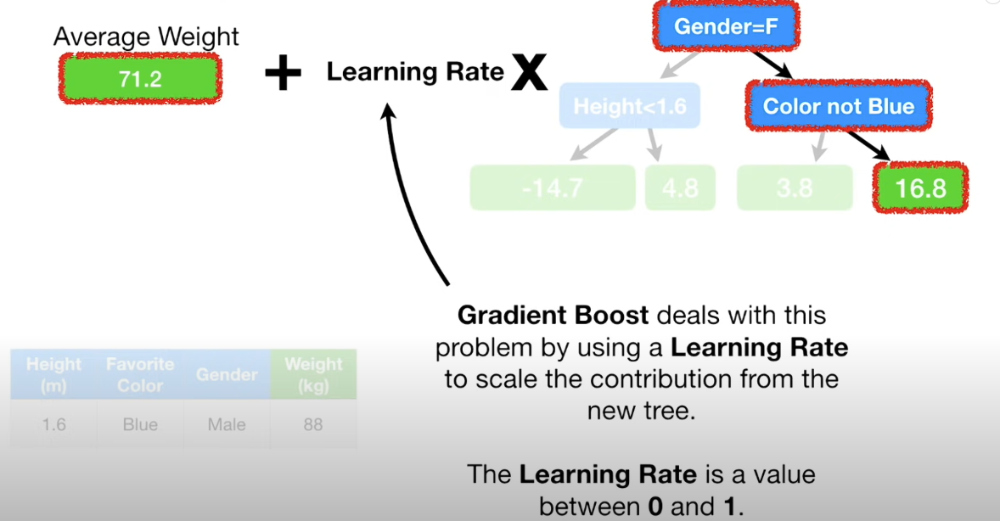

## Gradient Boosted Decision Trees

> I got to know the series of Gradient Boosted Decision Trees (GBDT) at the time for developing classification/regression algorithms for time series data. GBDT algorithms include XGBoost, LightGBM and CatBoost. This article gives a brief explanation of the basic idea of GBDT.

### Useful Resources (References)
- [Clear explanation of GBDT](https://www.youtube.com/watch?v=3CC4N4z3GJc&t=78s)

### Questions
When we come to algorithms based on trees, we would like to know some questions of how to construct trees. Specifically, the trees have leaf nodes and splitting nodes. The questions are listed below:

1. How to choose the proper features and the value of the features for constructing a splitting nodes ?
2. When to stop split the node and obtain the leaf node ?
3. How to combine the results of different trees or what are the relationships between different trees ?
4. How to constrain the size of trees ?

In the following sections, these questions will be answered.

### GBDT trees for regression
Let's start with building trees for regression. Given an example of predicting weights from height, favorite color, and gender shown in the figure below:

    

#### General ideas
Initially, the first tree (stump) is created by averaging all the weights. It is used as the first decision tree. The difference between the ground truth and the predicted value is called **residual**.

Next, a decision tree for predicting these residuals are created.

    

Afterwards, the values of this tree is added to previous tree with a learning rate. This can explain why they are called gradient boosting decision trees. GBDT trees are a bunch of weak learners. In addition, smaller learning rate in right direction can achieve better results with lower variances.

    

